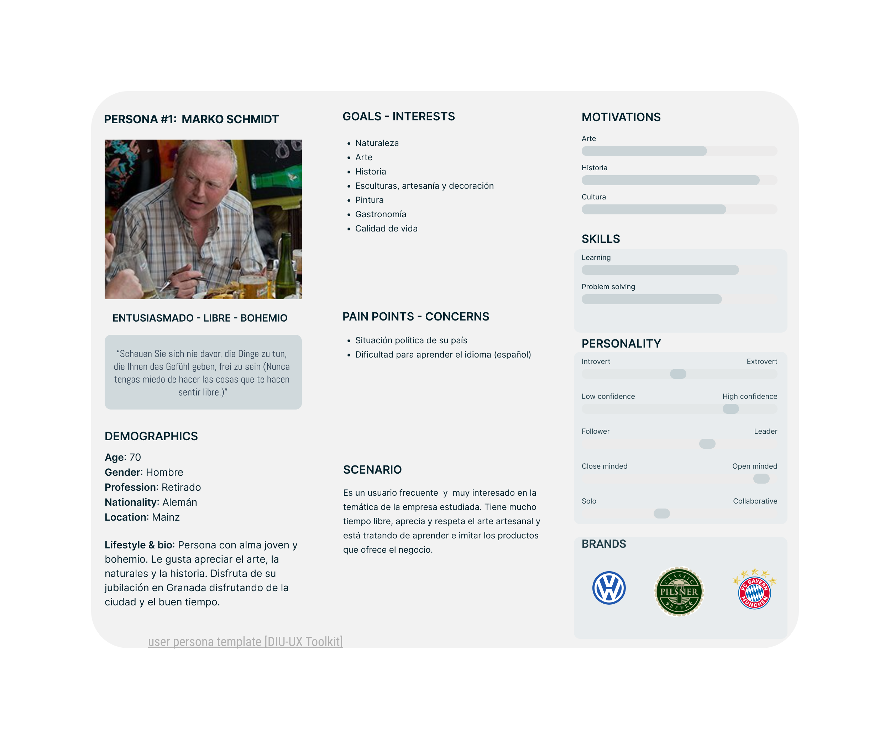

# DIU23
Prácticas Diseño Interfaces de Usuario 2022-23

Grupo: DIU3.QL  
Curso: 2022/23 
Updated: 13/3/2023

Proyecto: 
>>> Decida el nombre corto de su propuesta en la práctica 2 

Descripción: 

>>> Describa la idea de su producto en la práctica 2 

Logotipo: 
>>> Opcionalmente si diseña un logotipo para su producto en la práctica 3 pongalo aqui

Miembros
 * Carlos Quesada Pérez     
 * Jorge Lombardo Bergillos

----- 

# Proceso de Diseño 

## Paso 1. UX Desk Research & Analisis 

 1.0 Empathy Map
-----
>>> La página a analizar es la siguiente: Artesanía Nazarí https://artesanianazari.es/ 
>>> 

 1.a Competitive Analysis
-----

>>> Hemos comparado entre tres talleres artesanos similares de la ciudad de Granada y vistos sus similitudes y diferencias. 
>>> 

 1.b Persona
-----

>>> Las personas que hemos elegidos se diferencian en la edad pero comparten rasgos y aficiones que son compatibles con la idea de negocio del taller.
>>> 

 1.c User Journey Map
----

>>> Son bastante frecuentes puesto que la gente en Granada siempre busca culturizarse y hay gran cantidad de turistas extranjeros

 1.d Usability Review
----
>>>  Revisión de usabilidad:
>>> - Enlace al documento: [(P1/Usability-review-template.xlsx)](https://github.com/carlosqp-UGR/DIU/blob/master/P1/Usability-review-template.xlsx)
>>> - Valoración final (numérica): 68
>>> - Comentario sobre la valoración: En general la página está muy decorada y aunque para gente que no se entienda muy bien con las tecnologías puede resultar un poco complicada de utilizar.

## Paso 2. UX Design  

 2.a Feedback Capture Grid / EMpathy map / POV
----

>>> Comenta con un diagrama los aspectos más destacados a modo de conclusion de la práctica anterior,

 Interesante | Críticas     
| ------------- | -------
  Preguntas | Nuevas ideas
  
    
>>> ¿Que planteas como "propuesta de valor" para un nuevo diseño de aplicación para economia colaborativa ?
>>> Problema e hipótesis
>>>  Que planteas como "propuesta de valor" para un nuevo diseño de aplicación para economia colaborativa te
>>> (150-200 caracteres)

2.a Ideacion - malla receptora

 2.b ScopeCanvas
----

 2.cTasks analysis 
-----

 2.d IA: Sitemap + Labelling 
----

>>> Identificar términos para diálogo con usuario  

Término | Significado     
| ------------- | -------
  Login¿?  | acceder a plataforma

 2.d Wireframes

-----

>>> Plantear el  diseño del layout para Web/movil (organización y simulación ) 

## Paso 3. Mi UX-Case Study (diseño)

 3.a Moodboard
-----

>>> El moooboard ha sido diseñado con Figma en el cual figuran:

1.- Lopotipos: Hay diferentes diseños del logotipo para combinar con todos los fondos e incluso para su uso en cabecera de redes sociales como Twitter. Diseñados en canva

2.- Tipografía: Tipo de letra que será utilizada en la página. Hemos escogido dos tipografías: Cairo y Lateef. La combinación de ambas es muy fiel a la temática nazarí que se quiere transmitir tanto en el producto como en la UI.

3.- Paleta de colores: Todos los colores que darán decoración a la web. Hemos optado por los colores cálidos, que recuerdan a la arcilla, la cerámica, el pasado, la tradición.

4.- Imágenes. Nos sirven como inspiración para la página (ver imágenes en el MoodBoard).

  3.b Landing Page
----

>>> La Landing Page ha sido diseñada con Figma y nos presenta la página web con acceso a sus diferentes páginas/secciones principales. Consta de un título y un subtítulo motivador, una foto que sirve como 
>>> introducción a la web y un botón de acceso usando los colores y fuentes de letra del moodboard.

 3.c Guidelines
----

>>> Tras informarnos acerca de los patrones de diseño y guidelines hemos decidido añadir:

>>>>Formularios de entrada para que el usuario pueda seleccionar la visita que más le convenga de la forma más cómoda posible.

>>>>Un scroleable para organizar de una manera mas ordenada la galería de fotos del taller así como de algunas actividades de visita.

>>>>El landing page, que inicialmente no lo habíamos planteado.

>>>>Una tipografía clara y acorde con la temática.

  3.d Mockup
----

>>> Layout: Mockup / prototipo HTML  (que permita simular tareas con estilo de IU seleccionado)

 3.e ¿My UX-Case Study?
-----

>>> Publicar my Case Study en Github..
>>> Documente y resuma el diseño de su producto en forma de video de 90 segundos aprox

## Paso 4. Evaluación 

 4.a Caso asignado
----

>>> Breve descripción del caso asignado con enlace a  su repositorio Github

 4.b User Testing
----

>>> Seleccione 4 personas ficticias. Exprese las ideas de posibles situaciones conflictivas de esa persona en las propuestas evaluadas. Asigne dos a Caso A y 2 al caso B
 

| Usuarios | Sexo/Edad     | Ocupación   |  Exp.TIC    | Personalidad | Plataforma | TestA/B
| ------------- | -------- | ----------- | ----------- | -----------  | ---------- | ----
| User1's name  | H / 18   | Estudiante  | Media       | Introvertido | Web.       | A 
| User2's name  | H / 18   | Estudiante  | Media       | Timido       | Web        | A 
| User3's name  | M / 35   | Abogado     | Baja        | Emocional    | móvil      | B 
| User4's name  | H / 18   | Estudiante  | Media       | Racional     | Web        | B 

. 4.c Cuestionario SUS
----

>>> Usaremos el **Cuestionario SUS** para valorar la satisfacción de cada usuario con el diseño (A/B) realizado. Para ello usamos la [hoja de cálculo](https://github.com/mgea/DIU19/blob/master/Cuestionario%20SUS%20DIU.xlsx) para calcular resultados sigiendo las pautas para usar la escala SUS e interpretar los resultados
http://usabilitygeek.com/how-to-use-the-system-usability-scale-sus-to-evaluate-the-usability-of-your-website/)
Para más información, consultar aquí sobre la [metodología SUS](https://cui.unige.ch/isi/icle-wiki/_media/ipm:test-suschapt.pdf)

>>> Adjuntar captura de imagen con los resultados + Valoración personal 

 4.d Usability Report
----

>> Añadir report de usabilidad para práctica B (la de los compañeros)

>>> Valoración personal 

>>> ## Paso 5. Evaluación de Accesibilidad  (no necesaria)

>>>   5.a Accesibility evaluation Report 
>>>> ----

>>> Indica qué pretendes evaluar (de accesibilidad) sobre qué APP y qué resultados has obtenido 

>>> 5.a) Evaluación de la Accesibilidad (con simuladores o verificación de WACG) 
>>> 5.b) Uso de simuladores de accesibilidad 

>>> (uso de tabla de datos, indicar herramientas usadas) 

>>> 5.c Breve resumen del estudio de accesibilidad (de práctica 1) y puntos fuertes y de mejora de los criterios de accesibilidad de tu diseño propuesto en Práctica 4.

## Conclusión final / Valoración de las prácticas

>>> (90-150 palabras) Opinión del proceso de desarrollo de diseño siguiendo metodología UX y valoración (positiva /negativa) de los resultados obtenidos  

